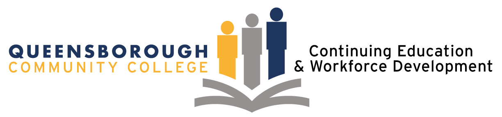

# ✨ Software Engineering Micro-Credential Career Track in Web Development (Boot Camp)

## About

QCC’s Software Engineering Micro-Credential Career Track in Web Development is designed to provide learners passionate for a career in Software Engineering to quickly develop highly in-demand web development skills, including programming languages, tools, and technologies to succeed in front end and back end development, as well as full stack development. This intensive Boot Camp will immerse learners in a 100-hour online development environment over an intensive five-week time frame and is led by Software Engineering Industry experts and Instructors.

### Topics to be covered:

:one: Introduction to Software Engineering

:two: Python Programming

:three: JavaScript Fundamentals

:four: HTML; CSS; GitHub; PostgreSQL

### Learning Outcomes:

:white_check_mark: Complete a personal portfolio and a group project that spans the entirety of full stack application.

:white_check_mark: Complete programming skill set to succeed in web development role.

:white_check_mark: Qualify to apply for both internships and employment opportunities.

### Program Requirements:

✔️ Minimum 18 years of age

✔️ NYC resident

✔️ Unemployed/underemployed, Veterans & special populations encouraged to apply

✔️ Authorized to work in the U.S.

✔️ Passionate about a career in Software Engineering
